# Productly Landing Page

## Productly — это адаптивный лендинг, созданный с использованием HTML, CSS и jQuery. Проект включает секции о продукте, командах, блог и футер с формой подписки.

### 💥 Особенности проекта
- Адаптивный дизайн для десктопов и мобильных устройств
- Использование slick-slider для слайдера новостей
- Много секций: Top, Tools, Direction, Team, Blog, Footer
- Кастомные кнопки и hover-эффекты
- Чистый CSS с использованием шрифтов Google Fonts (Poppins)

## 🛠 Используемые технологии
- HTML5
- CSS3
- jQuery
- Slick Slider
- Google Fonts (Poppins)


## 📁 Строение папок проекта

```
Productly__website
├─ css
│  ├─ jquery.fancybox.css
│  ├─ media.css
│  ├─ reset.css
│  ├─ slick.css
│  └─ style.css
├─ images
│  ├─ Avator1.png
│  ├─ Avator2.png
│  ├─ Avator3.png
│  ├─ Avator4.png
│  ├─ Avator5.png
│  ├─ burger-menu-right-svgrepo-com.svg
│  ├─ direction__item-img.png
│  ├─ direction__item-img2.png
│  ├─ direction__item-img3.png
│  ├─ font__team.png
│  ├─ font__tolls.png
│  ├─ font__top.png
│  ├─ galochka.svg
│  ├─ Logo.png
│  ├─ play__icon.svg
│  ├─ slider_3.jpg
│  ├─ slider__1.jpg
│  ├─ slider__2.jpg
│  ├─ tools__icon1.svg
│  ├─ tools__icon2.svg
│  ├─ tools__icon3.svg
│  └─ tools__icon4.svg
├─ index.html
└─ js
   ├─ jquery.fancybox.min.js
   ├─ main.js
   └─ slick.min.js
```

## :computer: На десктопном устройстве 
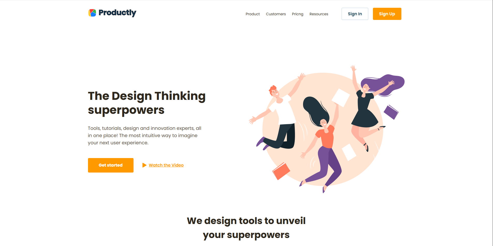
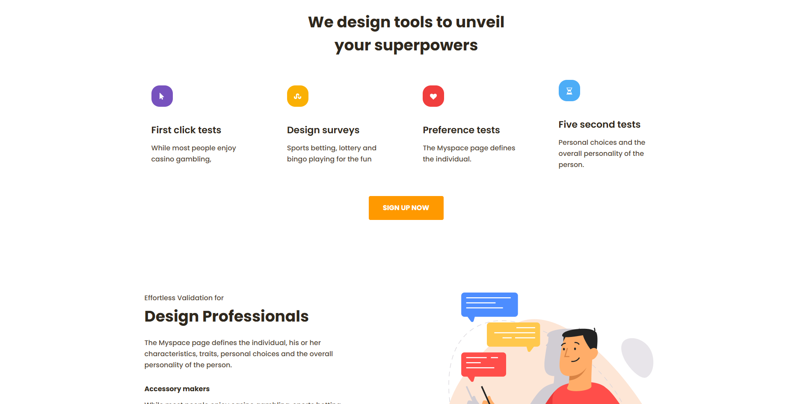

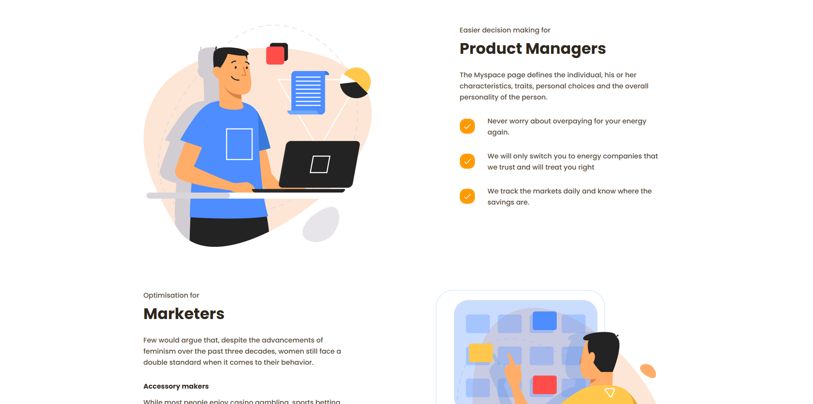

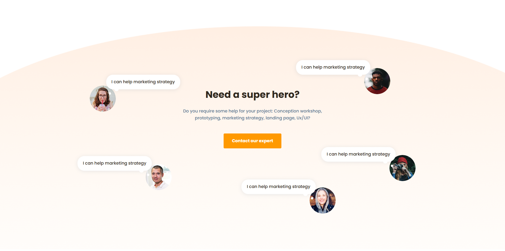
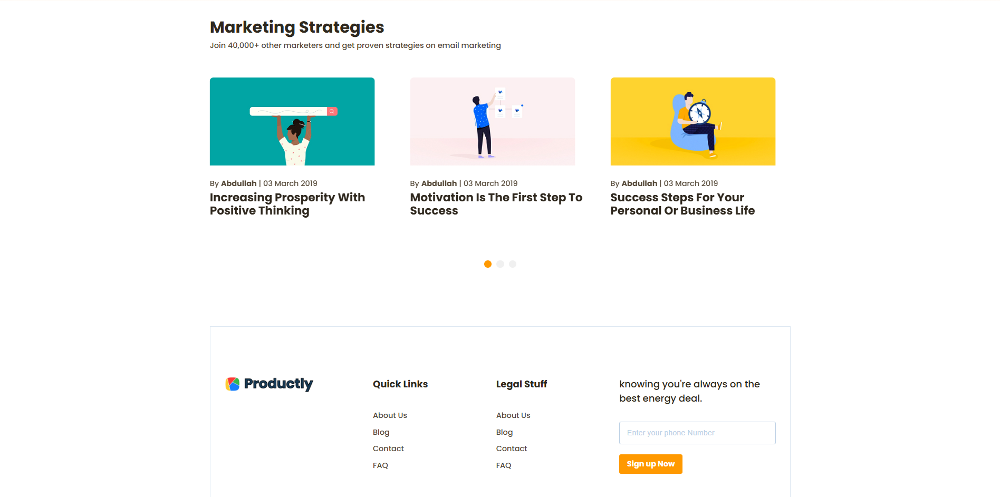

## 📱: На мобильном устройстве 
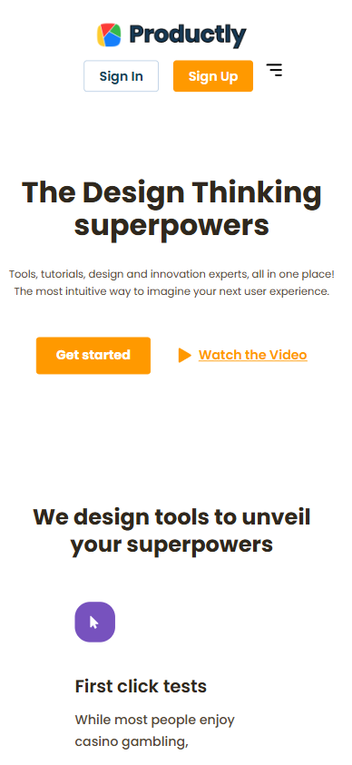

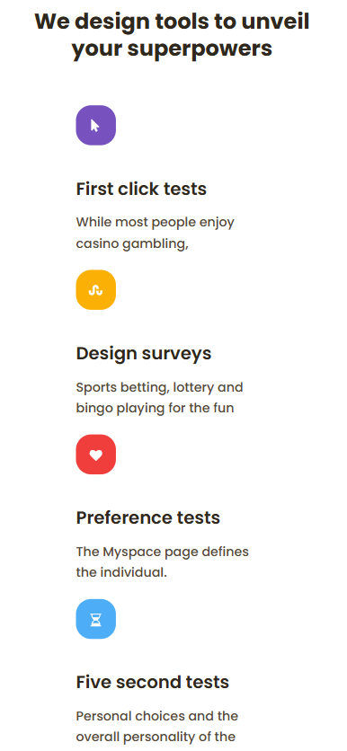

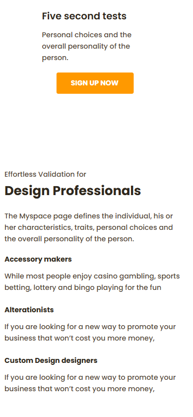

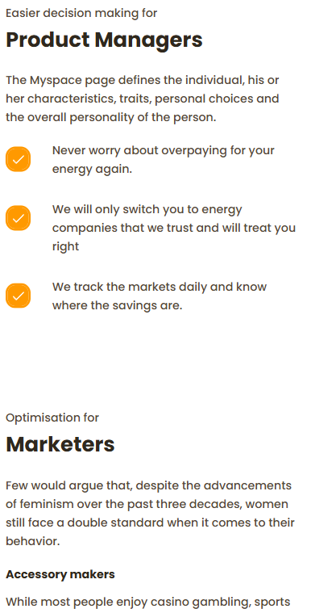


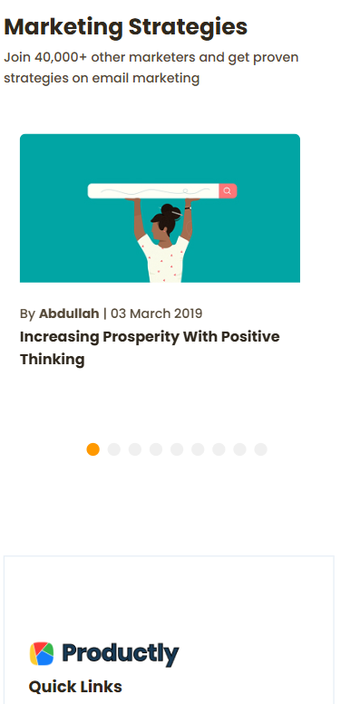

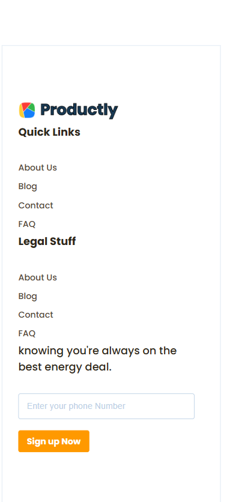

## 👨‍💻 Автор

Виктор Федотов

HTML / CSS 

